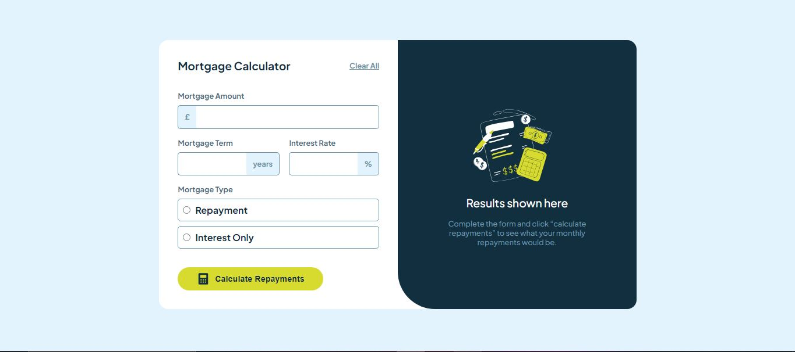

# Frontend Mentor - Mortgage repayment calculator solution

This is a solution to the [Mortgage repayment calculator challenge on Frontend Mentor](https://www.frontendmentor.io/challenges/mortgage-repayment-calculator-Galx1LXK73). Frontend Mentor challenges help you improve your coding skills by building realistic projects.

## Table of contents

- [Overview](#overview)
  - [The challenge](#the-challenge)
  - [Screenshot](#screenshot)
  - [Links](#links)
  - [Built with](#built-with)
  - [What I learned](#what-i-learned)
  - [Continued development](#continued-development)
  - [Useful resources](#useful-resources)
- [Author](#author)

## Overview

Cloning a mortgage repayment site using HTML, CSS and JavaScript

### The challenge

Users should be able to:

- Input mortgage information and see monthly repayment and total repayment amounts after submitting the form
- See form validation messages if any field is incomplete
- Complete the form only using their keyboard
- View the optimal layout for the interface depending on their device's screen size
- See hover and focus states for all interactive elements on the page

### Screenshot

### Links

- Live Site URL: [Random advice generator app](https://your-live-site-url.com)

### Built with

- Semantic HTML5 markup
- CSS custom properties
- Flexbox
- CSS Grid
- JavaScript

### What I learned

The essentials of interactive form validation using JavaScript
To see how you can add code snippets, see below:

### Continued development

Javascript and Tailwind CSS

### Useful resources

- [Client Side Validation](https://www.freecodecamp.org/news/form-validation-in-javascript/) - This helped me for XYZ reason. I really liked this pattern and will use it going forward.

## Author

- Frontend Mentor - [@Callyx2002](https://www.frontendmentor.io/profile/@Callyx2002)
- Twitter - [@CalebArodu](https://www.twitter.com/@CalebArodu)
- LinkedIn - [Caleb Arodu](https://ng.linkedin.com/in/caleb-arodu-208121249)
  **Note: Delete this note and add/remove/edit lines above based on what links you'd like to share.**
