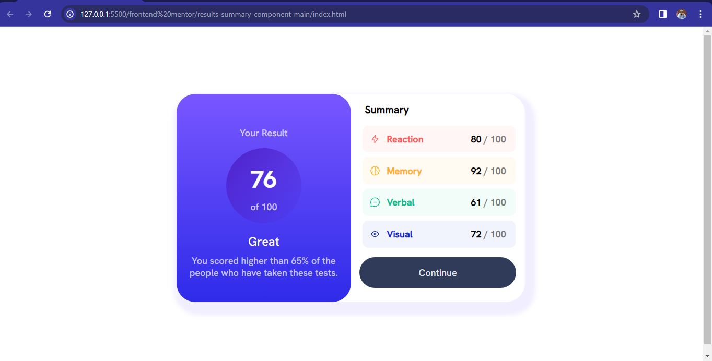

# Frontend Mentor - Results summary component solution

This is a solution to the [Results summary component challenge on Frontend Mentor](https://www.frontendmentor.io/challenges/results-summary-component-CE_K6s0maV). Frontend Mentor challenges help you improve your coding skills by building realistic projects.

## Table of contents

- [Overview](#overview)
  - [The challenge](#the-challenge)
  - [Screenshot](#screenshot)
  - [Links](#links)
  - [Built with](#built-with)
  - [What I learned](#what-i-learned)
  - [Continued development](#continued-development)
- [Author](#author)

## Overview

Cloning a result summary page

### The challenge

Users should be able to:

- View the optimal layout for the interface depending on their device's screen size
- See hover and focus states for all interactive elements on the page
- **Bonus**: Use the local JSON data to dynamically populate the content
  i added a little JavaScript and DOM manipulation to the project

### Screenshot

### Links

- Live Site URL: [Add live site URL here](https://your-live-site-url.com)

### Built with

- Semantic HTML5 markup
- CSS custom properties
- Flexbox
- Mobile-first workflow
- JavaScript and DOM manipulation

### What I learned

I learnt how to first implement mobile design before using media query to do the desktop design

### Continued development

CSS Flexbox and responsive design

## Author

- Website - [Caleb Arodu](https://www.your-site.com)
- Frontend Mentor - [@Callyx2002](https://www.frontendmentor.io/profile/@Callyx2002)
- Twitter - [@CalebArodu](https://www.twitter.com/@CalebArodu)
- LinkedIn - [Caleb Arodu](https://ng.linkedin.com/in/caleb-arodu-208121249)
